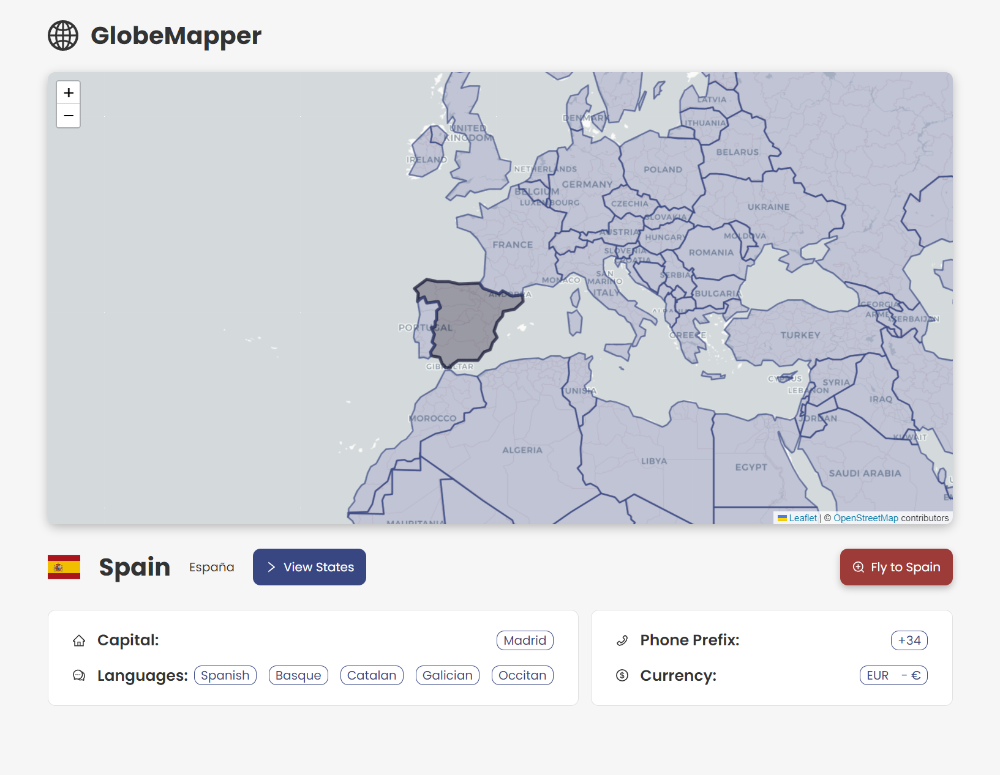
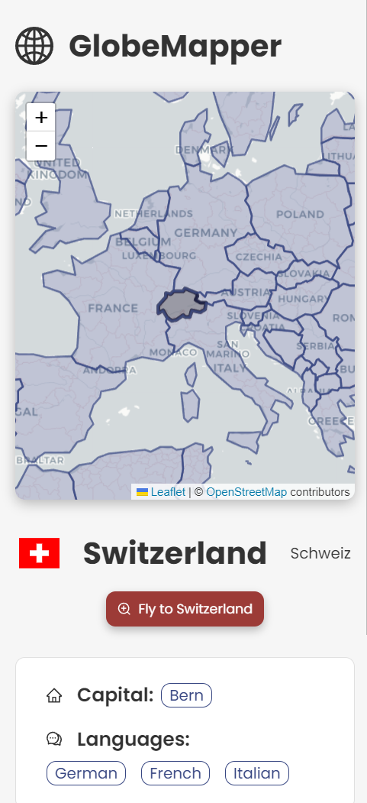

# GlobeMapper

## Introduction
This application is a Next.js-based web platform designed to provide interactive information about countries around the world. Leveraging GraphQL for data retrieval and Leaflet for dynamic map rendering, users can explore various countries, view details, and interact with geographic features.

### Key Features:
* **Dynamic Map Interaction**: Utilizes Leaflet and GeoJSON layers to provide an interactive map experience. Users can click on countries to view additional information.
* **GraphQL Integration**: Utilizes Apollo Client to fetch data from a GraphQL endpoint, enabling seamless access to country details.
* **Responsive Design**: Ensures the application is optimized for various devices, allowing users to explore content on desktops, tablets, and smartphones.
* **Styling with Ant Design**: Utilizes the Ant Design design system for consistent and visually appealing UI elements.
* **State Management with React Context**: Manages application state efficiently using React Context, enabling seamless data management across components.

## Deployed APP in Vercel
The deployed APP can be found at:

https://globe-mapper-two.vercel.app/

## Screenshots:



## Getting Started

Clone this repository in your local machine.
```bash
git clone https://github.com/Vinjas/solar-radiation-tool.git
```

Navigate to the root of the project and install all the neccesary dependencies:
```bash
npm install
```

This is a [Next.js](https://nextjs.org/) project bootstrapped with [`create-next-app`](https://github.com/vercel/next.js/tree/canary/packages/create-next-app).

First, run the development server:

```bash
npm run dev
# or
yarn dev
# or
pnpm dev
# or
bun dev
```

Open [http://localhost:3000](http://localhost:3000) with your browser to see the result.

### Unit Testing
Some unit test have been added using Jest + React Testing Library.

To execute the test just run this in the root project folder:

```bash
npm run test
# or
npm run test:watch
```

## Countries API

The following GraphQL endpoint has been used to retrieve all the countries data:

https://countries.trevorblades.com/

https://github.com/trevorblades/countries

## Technical and Architectural Choices
### Next.js
The project is built using Next.js with TypeScript, as specified in the requirements. Next.js's page router was chosen over the app router for familiarity and time-saving benefits.

### Styling
The design utilizes Ant Design for consistency with the project's design system. Styled-Components are predominantly used for styling, with SASS for global CSS and typography. Ant Design icons are integrated for UI elements.

### GraphQL
Basic Apollo Client is implemented to fetch data from the provided Countries GraphQL endpoint. Queries are defined to retrieve country information using ISO 2 codes.

### Leaflet Map and GeoJSON
Leaflet is chosen for dynamic map rendering, with the react-leaflet wrapper for easier integration with React. The map utilizes the light theme of cartodb-basemaps. Interaction with countries on the map is enabled using GeoJSON layers, with events for click, mouse in, and mouse out.

### State Management
React Context is used for state management, storing the selected country, coordinates, and Leaflet map instance.

### Extra Features
A Flags library is implemented to display country flags dynamically. Currency symbols are also included for additional information. A modal displays states for countries with state information.

### Testing
Jest and React Testing Library are integrated for unit testing of components, context, and utility functions.

## Potential Improvements
* Localization: Implement i18n for multi-language support.
* Filtering: Add filtering options for countries based on language or currency.
* Enhanced UI/UX: Improve user experience with features like multi-select, country search, and dynamic theme selection.

## Future Considerations
* Improved Map Responsiveness: Address rendering aspect ratio issues for better display across devices.
* Testing Coverage: Expand unit tests to cover more components and edge cases.
* Performance Optimization: Identify and implement optimizations to reduce load times and enhance efficiency.
* Accessibility: Ensure accessibility features such as keyboard navigation and screen reader compatibility.
* Error Handling: Implement comprehensive error handling mechanisms and consider edge cases for enhanced stability.
* 
